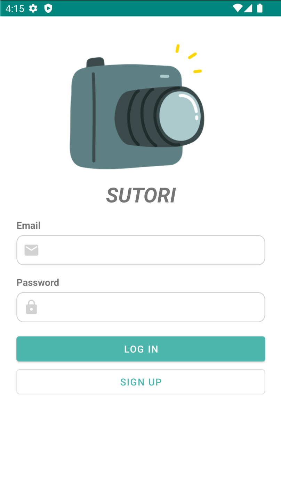
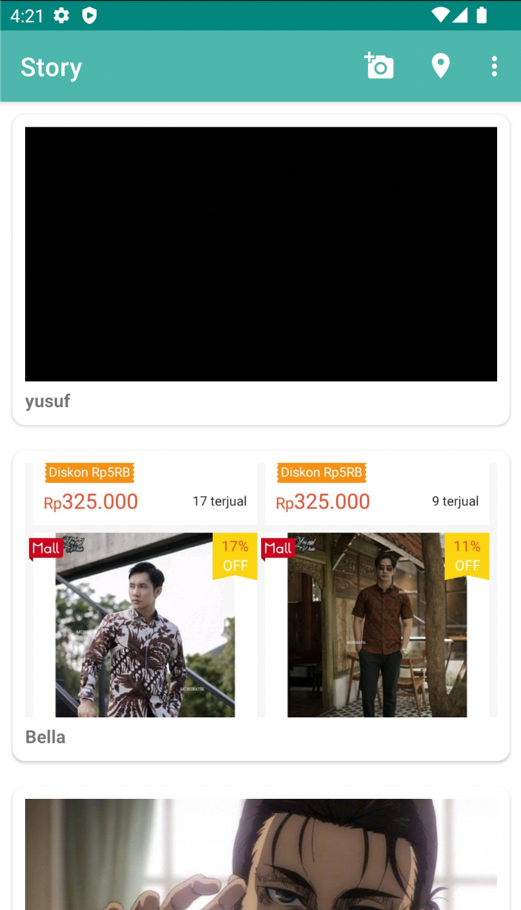
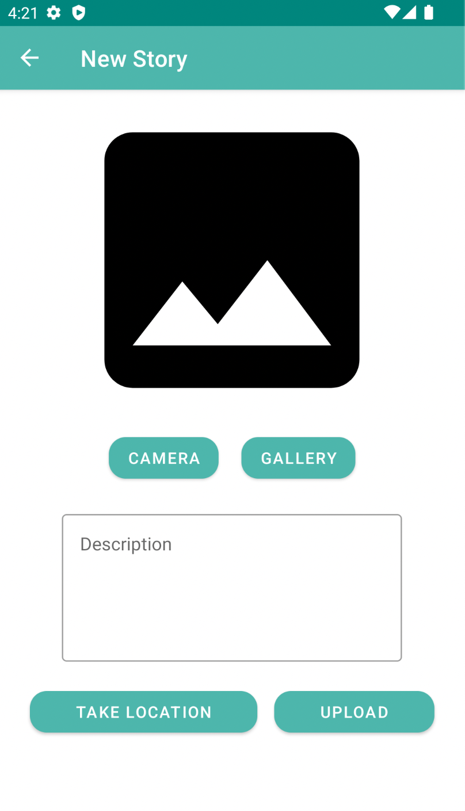
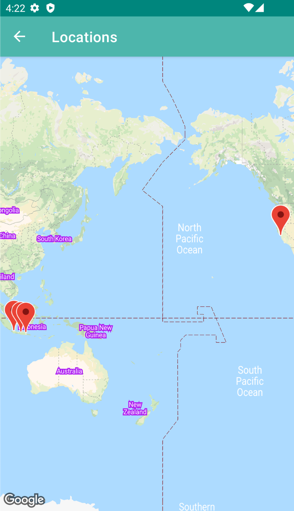

# Story App

This is a story app which can upload story (image and caption) and view story from other users. This project is to complete Dicoding "Intermediate Android Application" course's submissions. There is 2 assignments:

**1st Assignment**
- Login and register feature, save token in SharedPreferences
- Upload story with camera or gallery
- Use CustomView
- Show story list and story detail with animation
- Use ViewModel and LiveData architecture

**2nd Assignment**
- Upload story with location
- Show maps of stories' location
- Show story list with Paging3

## Screenshots

  
   

  
  

